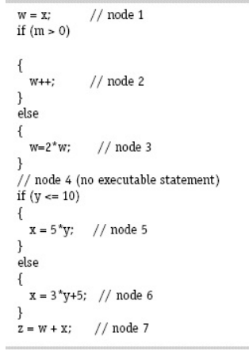
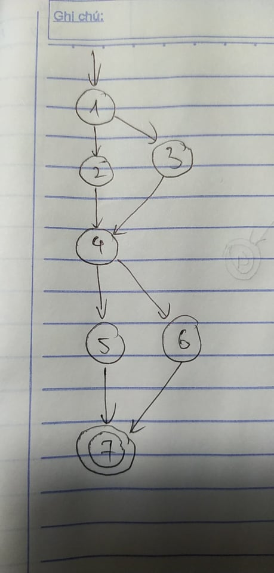

### Use the following program fragment for questions a–e below.

#### (a) Draw a control flow graph for this program fragment. Use the node numbers given above.

#### (b) Which nodes have defs for variable w?
Các nút 1, 2, 3 có defs cho biến w.
#### (c) Which nodes have uses for variable w?
Các nút 2, 3, 7 có uses cho biến w.
#### (d) Are there any du-paths with respect to variable w from node 1 to node 7? If not, explain why not. If any exist, show one.
Không có đường đi du-path liên quan đến biến w từ nút 1 đến nút 7 vì từ nút 4 đến 6 không sử dụng đến biến w.
#### (e) List all of the du-paths for variables w and x
Du-paths cho biến w: [1,2], [1,3], [2,4,5,7], [2,4,6,7], [3,4,5,7], [3,4,6,7].
Du-paths cho biến x: [5,7], [6,7].

