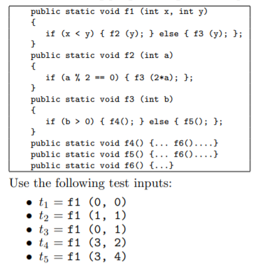
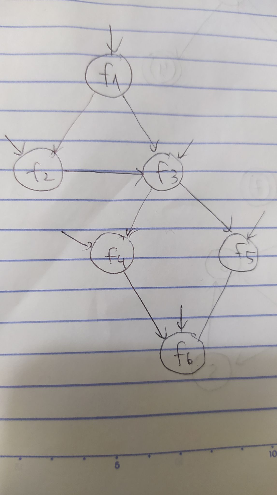

#### (a) Draw the call graph for this program fragment.

#### (b) Give the path in the graph followed by each test.
Các đường trong biểu đồ:
t1: [f1, f3, f5, f6]  
t2: [f1, f3, f4, f6]  
t3: [f1, f2]  
t4: [f1, f3, f4, f6]  
t5: [f1, f2, f3, f4, f6]  
#### (c) Find a minimal test set that achieves Node Coverage.
Tập kiểm thử tối giản thỏa mãn bao phủ nút: {t1, t2, t3}, {t1, t3, t4}, {t1, t5}.
#### (d) Find a minimal test set that achieves Edge Coverage.
Tập kiểm thử tối giản thỏa mãn bao phủ cạnh: {t1, t5}.
#### (e) Give the prime paths in the graph. Which prime path is not covered by any of the tests above?
Các đường nguyên tố: [f1, f2, f3, f4, f6], [f1, f2, f3, f5, f6], [f1, f3, f4, f6], [f1, f3, f5, f6]. Đường [f1, f2, f3, f5, f6] không bao phủ bất cứ tập kiểm thử nào ở các câu trên.
