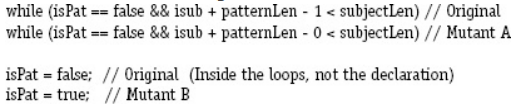

### Refer to the patternIndex() method in the PatternIndex program in Chapter 7. Consider Mutant A and Mutant B given below. Implementations are available on the book website in files.

#### (a) If possible, design test inputs that do not reach the mutants.
Đầu vào kiểm thử không tới được các đột biến:  
A: TestPat X  
B: TestPat X X
#### (b) If possible, design test inputs that satisfy reachability but **not infection** for the mutants.
Đầu vào kiểm thử thỏa mãn tính tới được nhưng không lây nhiễm cho các đột biến:  
A: TestPat yet yes  
B: Không có.
#### (c) If possible, design test inputs that satisfy reachability and infection, but **not propagation** for the mutants.
Đầu vào kiểm thử thỏa mãn tính tới được và lây nhiễm nhưng không lan truyền cho các đột biến:  
A: TestPat yet yes  
B: TestPat yet yes
#### (d) If possible, design test inputs that **strongly kill** the mutants.
Đầu vào kiểm thử triệt tiêu được các đột biến:  
A: TestPat X X  
B: TestPat ohyeahyes yes