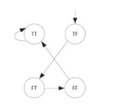

Translate the following finite state machine into an SMV machine.

Máy SMV:
```
MODULE main
#define false 0
#define true 1
VAR
      x, y : boolean;
ASSIGN
      init (x) := true;
      init (y) := false;

      next (x) := case
    	 x & !y : false;
    	 !x & y : true;
    	 !x & !y : true;
    	 true : x;
      esac;

      next (y) := case
    	 !x & y : false;
    	 !y : true;
     	 true : y;
      esac;
```